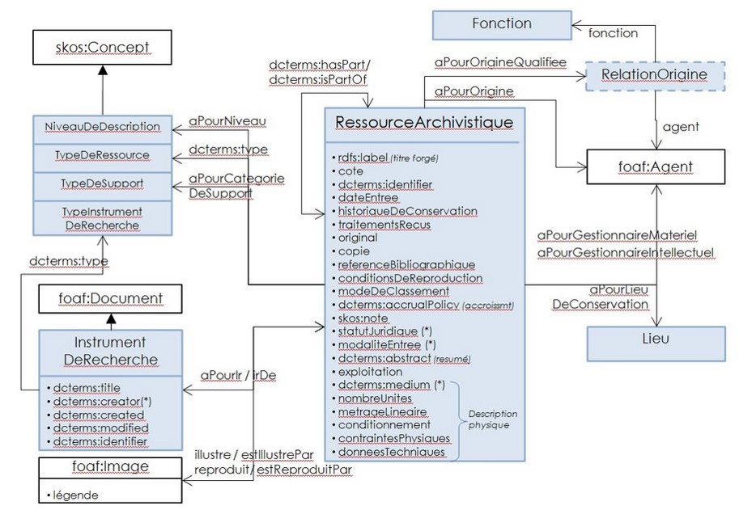

class: center, top
background-image: url(images/triplet-rhizome-data-4.jpg)
background-position: left top;
background-repeat: no-repeat;
background-size: contain;

.footnote[
      Support de formation distribué en Creative Commons CC-By-SA 4.0 ; édité par Rhizome-data et Logilab pour le compte de l'Association des Archivistes Français.]

# formation Webdata AAF

---
layout: true
class: left, top
background-image: url(images/logo-rhizome-data-s.jpg)
background-position: right top
background-repeat: no-repeat

# Programme

.footnote[
      [Programme](#programme1)]

---
name: programme1

### La carte

1. co-construction programme et attentes (1h)
2. Présentation de l'historique du web et des données liées (2h)
3. Présentation du modèle de structuration par ontologie (2h)
4. [Enjeux et prespectives](#enjeux) : publication, visualisation, alignement (1h30)
5. présentation de SKOS (1h30)
6. Présentation du modèle de données RIC (2h)
7. présentation de l'outillage (3h)
8. exercices(7h)

---
layout: true
class: left, top
background-image: url(images/logo-rhizome-data-s.jpg)
background-position: right top
background-repeat: no-repeat

.footnote[
      [Programme](#programme1)]

---
## Attentes des participant.es

* comprendre comment s'articulent les outils et normes et voir comment les appliquer ou les demander avec les outils que j'utilise
--

* diffusion et partage des connaissances sur le web
--

* méthodologie de mise en oeuvre, pré-requis et outils
--

* interopabilité des schémas pour la mise en relation
--

* méthodologie de mise en relation
--

* outils

---
layout: true
class: left, top
background-image: url(images/logo-rhizome-data-s.jpg)
background-position: right top
background-repeat: no-repeat

# Programme

.footnote[
      [Programme](#programme1)]

---

### Jour 1

1. co-construction programme et attentes (9h-10h)
2. Présentation de l'historique du web et des données liées (10h-12h)
   1. Au commencement était l’hypertexte
   2. Qu’est ce que le Web sémantique ?
--

3. Présentation du modèle de structuration par ontologie (14h-16h)
   1. Les concepts du Web sémantique
   2. Applications
4. Enjeux et prespectives : publication, visualisation, alignement (16h-17h30)
   1. Métadonnées culturelles et transition web 3.0
   2. Publication
   3. cycle de vie
   4. enjeux

---
layout: true
class: left, top
background-image: url(images/logo-rhizome-data-s.jpg)
background-position: right top
background-repeat: no-repeat

.footnote[
      [Programme](#programme1)]

---

## 1. co-construction programme et attentes (9h-10h)

---

## 2. Contexte et enjeux

---

### 2.1 Evolution des pratiques des utilisateurs

La recherche d'information aujourd'hui pour beaucoup de gens c'est le web:

.reduite[]

---

### 2.1 Evolution des pratiques des utilisateurs

Les archives sur le WEB aujourd'hui c'est :

Exemple : Jacques Chaban-Delmas

.reduite[]

---

### 2.1 Evolution des pratiques des utilisateurs

La connexion sur les sites des services d'archives (*Qui sont les publics des Archives ?*, SIAF, 2015)

.reduite[]

---

### 2.1 Evolution des pratiques des utilisateurs

Le but d'une visite sur un site d'archives aujourd'hui c'est : 

.reduite[]

---

### 2.2 Enjeux liés aux utilisateurs du Web

**Enjeux liés à une meilleure prise en compte du public dans toute sa diversité** 

<u>Adopter les standards du Web sémantique</u> : 

- Pour sortir nos instruments de recherche et nos notices d'autorité du Web profond 
- Pour aller à la rencontre de nouveaux utilisateurs sur le Web et sortir d'un public "d'habitués"

<u>Modifier la structure de l’information archivistique</u> : 

- Pour adapter nos sites aux besoins des utilisateurs et à leurs nouvelles pratiques de recherche 
- Pour mieux structurer les résultats d’une recherche simple
- Pour ouvrir les résultats vers de nouveaux horizons (favoriser la sérendipité)

---

### 2.2 Enjeux pour les archivistes

<u>Adopter les standards du Web de données</u> : 

- Pour enrichir leurs descriptions par l’apport de données externes publiées par d’autres fournisseurs du Web les rendant ainsi plus complètes et leur conférant une valeur ajoutée.
- Pour assurer la traçabilité des archives numériques

<u>Modifier la structure de l’information archivistique</u> :

- Pour ne pas avoir à répéter indéfiniment les mêmes informations d'un instrument de recherche à un autre ou d'une notice d'autorité à une autre ou d'un profil SEDA à un autre.

- Pour harmoniser/normaliser l’information fournie

Le Web de données représente une **opportunité** nouvelle pour diffuser et favoriser la réutilisation des métadonnées descriptives archivistiques. 

---

### 2.3 Enjeux économiques

Adopter les standards du Web de données : 

- Pour sortir de notre isolement technologique 

- Pour avancer du même pas que les autres, notamment que le monde des bibliothèques

- Pour qu’à terme, la maintenance de nos sites coûte moins cher

- Mutualiser le travail des archivistes 

---

### 2.4 La feuille de route sur les métadonnées culturelles et la transition Web 3.0 du ministère dela Culture et de la Communication

9 actions opérationnelles permettant au secteur culturel de prendre en compte les opportunités et les défis qu'offre le 3.0.

<u>Les 4 actions les plus significatives :</u> 

- L’identification normée et pérenne des ressources accessibles par Internet est un élément essentiel du Web sémantique.
- L’identification des auteurs est indispensable à la diffusion des ressources culturelles sur le Web : L’identifiant   international   ISNI   (International   Standard   Name   Identifier) 
- Créer et maintenir une interconnexion sémantique des grands référentiels culturels : le "graphe culture"
- Expérimenter l’interconnexion inter-institutionnelle des données culturelles

---

## 3. Présentation de l'histoire du web et des données liées (10h-12h)

### 3.1 Naissance d'internet

.reduite[]

---
### Web : a proposal (1989)

---

### 3.2 Le Web 

.reduite[]

---
### 3.2 Le modèle d'architecture du Web

---

### 3.2 Le Web

**Les problématiques du Web actuel** 

- Il est de plus en plus volumineux et diversifié

- Les informations et les services sont de moins en moins exploitables

- Il n’est pas fait pour être manipulé de façon intelligente par les programmes informatiques

- Il engendre des frustrations dans la recherche    

- Perte de temps considérable avant d’obtenir l’information désirée

---

### 3.3 Qu’est ce que le Web de données ?

.reduite[]

---

### 3.3 Qu’est ce que le Web de données ?

.reduite[]

---

### 3.3 Qu'est ce que le web de données ?

Je veux décrire des livres par catégories avec des informations sur les auteurs
et gérer les liens entre les différentes formes de représentation de ces livres
conservées dans différents lieux

--

Qu’est-ce que je souhaite décrire ?

* Un livre = Un titre, une description
* Un auteur = un nom, un prénom, des dates, des lieux
* Des représentations = des relations, des formes, des contenants et des contenus
* Des lieux de conservation : une provenance, des activités, des relations

--

Les ingrédients existants

* Dublin Core / SEDA / EAD
* EAC / FOAF / wgs84-pos / time
* PROV-O / RDFS / OWL

---

### 3.4 Web d'aujourd'hui versus Web de données

.reduite[]

---
### Le modèle de description RDF

Le sujet est toujours une URI.
Toute “chose” sur laquelle on veut faire des assertions (sujet) doit avoir une URI.
Les “choses” ont toujours un type : une CLASSE.

Le prédicat est toujours une URI.
Il permet d'exprimer les propriétés des
“choses”, ou les relations des “choses” entre elles

L‘objet peut être un texte (littéral) ou une URI.

Les classes et les propriétés sont déclarées dans des vocabulaires pour être réutilisées

RDF définit un graphe à base de triplets (sujet → prédicat → objet)
 Le sujet représente la ressource à décrire ;
 Le prédicat représente un type de propriété de la ressource ;
 L'objet représente la valeur de la propriété.

---
#### exemple

Décrire un concept du thésaurus matière

Exemple : 
ACTION PUBLIQUE est un terme français précisant le terme ADMINISTRATION qui englobe l’ensemble des descripteurs contrôlés utilisés par le vocabulaire contrôlé INTERDOC pour décrire les activités des services des collectivités publiques

ACTION PUBLIQUE est un terme
ACTION PUBLIQUE est français
ACTION PUBLIQUE précise le terme administration
ACTION PUBLIQUE fait partie du vocabulaire INTERDOC
INTERDOC est un vocabulaire pour décrire les activités des services des collectivités publiques

---

### 4 Présentation du modèle de structuration par ontologie

Les schémas de métadonnées servent à contrôler la saisie et développer la sémantique des informations

On assemble les descripteurs « métiers » dont on a besoin en fonction de ce que l’on veut représenter et des usages
des métadonnées, une méthode de raisonnement, un format d’organisation des connaissances et des systèmes d’organisation des connaissances

---

### La représentation en graphe

.reduite[]

---

### Le modèle FRBR, récement refondu dans le modèle unique IFLA - LRM : modèle de données de la transition bibliographique 

​Le modèle de données de [data.bnf.fr](http://data.bnf.fr/) expérimente et adapte le modèle [ le modèle FRBR (fonctionnalités requises pour les notices bibliographiques)     ](http://www.ifla.org/publications/functional-requirements-for-bibliographic-records) élaboré par la fédération internationale des associations et institutions de bibliothèques, l’[IFLA](http://ifla.org). [Data.bnf.fr](http://data.bnf.fr/) s’inscrit donc dans les évolutions récentes en matière de description bibliographique.

Ce modèle comprend trois groupes d'entités liées par des  relations : les informations sur les documents, les personnes physiques  ou morales, et les thèmes. 

---

Des données structurées et enrichies qui ne doivent pas  nous faire perdre de vue les finalités de la Transition bibliographique  et notamment le confort de l’usager dans les cinq grandes « tâches  utilisateurs » :

1. *Trouver* : Rechercher tout critère pertinent afin de rassembler des informations sur une ou plusieurs ressources présentant un intérêt ;
2. *Identifier* : Comprendre clairement la nature des ressources trouvées et faire la distinction entre des ressources similaires ;
3. *Sélectionner* : Déterminer l’adaptation de la ressource trouvée et choisir (en acceptant ou rejetant) des ressources spécifiques ;
4. *Obtenir* : Accéder au contenu de la ressource ;
5. *Naviguer* : Utiliser les relations qui existent entre une ressource et une autre pour les situer dans un contexte.

---
### Le modèle MDFA

Développé pour la société Arkhéia et son navigateur Bach

.reduite[]

---
### Le modèle archivesHub

Développé pour le projet [ArchivesHub](https://archiveshub.jisc.ac.uk/)

.reduite[]

---

### Le modèle SAEM

Développé pour le projet [rdae](https://referentiel.saemgirondin.fr)

.reduite[]

---

name: enjeux

## 4 Enjeux et prespectives : publication, visualisation, alignement (16h-17h30)

* décrire les objets en garantissant leur traçabilité
* Contrôler le vocabulaire de description
* Proposer différents axes de navigation
* Offrir des vues différentes d’une même information
* Relier des objets et des corpus
* Faciliter la pérennisation de l’information

---
### Relier des objets et des corpus (fonds)

1. Appliquer une norme métier : 
* EAD / EAC, SEDA bientôt RIC pour les archives, 
* MARC, FRBR pour les bibliothèques, 
* CIDOC-CRM / LIDO pour les musées 

Pour fédérer les pratiques et échanger facilement des informations

2. Réconcilier des référentiels : rapprocher ou réutiliser des thésaurus existants

**exemples** : 
* Thesaurus Archives : http://data.culture.fr/thesaurus
* Rameau : http://data.bnf.fr/liste-rameau
* Dewey http://dewey.info

3. Créer un référentiel réutilisable

* http://data.bnf.fr et http://wikidata.org (voir présentation semweb.pro 2015)

---

### Décrire une unité d'archives en RDF

Le modèle RDF permet de décloisonner les silos de données. 
Les référentiels permettent alors de les relier 

.reduite[]

---

[Explorer la galaxie depuis Boris Vian](http://en.lodlive.it/?http://dbpedia.org/resource/Boris_Vian)

* L’Écume des jours est un roman de Boris Vian publié en 1947 avec pour thèmes centraux l’amour, la maladie, la mort
* L’Écume des jours est un roman
* L’Écume des jours a pour auteur Boris Vian
* L’Écume des jours est paru en 1947
* L’Écume des jours a pour thèmes l’amour, la maladie, la mort
* J’irais cracher sur vos tombes a pour auteur Vernon Sullivan

.remark-code.inline[
http://dbpedia.org/page/Froth_on_the_Daydream 
http://data.bnf.fr/13091689/boris_vian/ 
dbpedia:Froth_on_the_Daydream rdf:type yago:Novel106367879
dbpedia:Froth_on_the_Daydream dcterms:creator dbpedia:Boris_Vian
dbpedia:Froth_on_the_Daydream dcterms:date "1947"
dbpedia:Froth_on_the_Daydream skos:subject dbpedia:Love
dbpedia-owl:wikiPageRedirects dcterms:creator dbpedia:Vernon_Sullivan
]

---

### Contrôler le vocabulaire de description

.pull-left[.reduite[]]
.pull-right[.reduite[]]

---

### 4.1 Métadonnées culturelles et transition web 3.0

Un graphe de connaissances qui décrit des objets identifiés par des identifiants uniques

---

**Exposition en Données liées (linked data) du Thésaurus pour l’indexation des archives locales.**

Le rôle des référentiels et vocabulaires contrôlés est de plus en plus déterminant dans la découverte des ressources. Les Archives de France ont donc saisi l’opportunité d’une révision de ce thésaurus en 2009 pour
expérimenter les opportunités offertes par le nouveau standard de structuration SKOS et le nouveau mode de publication proposés par le consortium W3C. Depuis 2011, un [site Web](http://data.culture.fr/thesaurus/) permet donc de naviguer au sein du thésaurus, d’en télécharger une version RDF/XML, mais surtout de l’interroger via le langage SPARQL qui est le langage de requête des données structurées en RDF, ces aspects de standardisation facilitant l’interopérabilité avec les systèmes qui utilisent ce référentiel. 
--
Ce projet a également été l’occasion d’expérimenter le décloisonnement des données en les alignant sur d’autres référentiels (le vocabulaire Rameau ainsi que DBPedia) et de travailler sur le choix et la mise en œuvre d’une solution pour la permanence des identifiants manipulés dans ce référentiel. La plate-forme de consultation du thésaurus a récemment fait l’objet d’importantes évolutions, avec l’intégration d’autres vocabulaires contrôlés du ministère de la Culture et de la Communication (MCC), notamment des services du patrimoine et de l’architecture. L’objectif est de créer un référentiel terminologique unifié permettant d’offrir aux usagers un accès unique et cohérent aux ressources terminologiques produites par le MCC et d’en démultiplier les usages.

---

# Jour 2

1. présentation de SKOS (9h-10h30)
2. Présentation du modèle de données RIC (10h30-12h30)
3. présentation de l'outillage (14h-17h)
   1. Traitements
   2. SPARQL
   3. Intégration et transformation

---
### Présentation de SKOS

SKOS est construit sur la base du langage RDF, et son principal objectif est de permettre la publication facile de vocabulaires structurés pour leur utilisation dans le cadre du Web de données.
les propriétés de mise en correspondance proposées dans SKOS permettent d'exprimer des correspondances entre concepts provenant de schémas différents
skos:exactMatch ou skos:closeMatch
skos:broadMatch, skos:narrowMatch, skos:relatedMatch
skos:semanticRelation

---

#### exemple

ACTION PUBLIQUE en SKOS

.remark-code[
<ACTION PUBLIQUE> rdf:type skos:Concept ; 
skos:prefLabel  "Action publique"@fr ; 
skos:altLabel    »Action administrative"@fr ; 
skos:broader <ADMINISTRATION> ; 
skos:inScheme <INTERDOC> . 

<ADMINISTRATION> rdf:type skos:Concept ; 
skos:prefLabel   "Administration"@fr ; 
skos:altLabel    "Collectivité"@fr ; 
skos:topConceptOf <INTERDOC> . 

<INTERDOC> rdf:type skos:ConceptScheme ; 
dct:title "un vocabulaire pour décrire les activités des services des collectivités publiques" ; 
skos:hasTopConcept <ADMINISTRATION> .
]
---
### Présentation de RIC

Décrire le contexte et les relations : le projet de norme Records in Context

Intégration des standards de description ISAD(G), ISAAR(CPF), ISDF et ISDIAH
Les entités de ce modèle s’articulent autour de la notion de record

.reduite[]

---
### Le modèle de données RIC

.reduite[]

---
### Les entités fondamentales

.reduite[]

---

### Jour 3

4. exercices

---

## A tester

- [skos editor](https://code.google.com/archive/p/skoseditor/)
- [Convert to RDF](https://www.w3.org/wiki/ConverterToRdf#Excel)
- [apache any23](http://any23.apache.org/)

---

## (In)Formations complémentaires

- MOOC Inria Web sémantique
- [PoolParty academy](https://www.poolparty.biz/academy/)
- [éditeurs d'ontologies](https://www.w3.org/wiki/Ontology_editors)
- [Bonnes pratiques pour publier un vocabulaire rdf](https://www.w3.org/TR/swbp-vocab-pub/)
- [tutorial Protégé Ontologie](https://protegewiki.stanford.edu/wiki/Ontology101)
- [liste d'outils pour ontologies](http://wiki.opensemanticframework.org/index.php/Ontology_Tools)

---

## Exemples

- [protégé](https://webprotege.stanford.edu/#projects/list)
- [BBC::Ontologie de la nourriture](https://www.bbc.co.uk/ontologies/fo)

---

## Bibiographie

* *Qui sont les publics des Archives ? : enquêtes sur les lecteurs, les internautes et le public des activités culturelles dans les services publics d’archives ( 2013-2014)*, SIAF, 2015 : [lien externe](https://francearchives.fr/file/08ccbaa3654282501138a7739ac59dbecc364552/static_8431.pdf)
* Métadonnées culturelles et transition web 3.0 : [lien externe](http://www.culture.gouv.fr/var/culture/storage/pub/feuille_de_route__metadonnees_culturelles_et_transition_web_3_0_janvier_2014/index.htm)
* Transition bibliographique : [lien externe](https://www.transition-bibliographique.fr/se-former/supports/)
* Source Flickr : [lien externe](https://www.flickr.com/photos/safari_vacation/6315269494/) (CC BY-SA)
* (https://news.netcraft.com/archives/2019/)